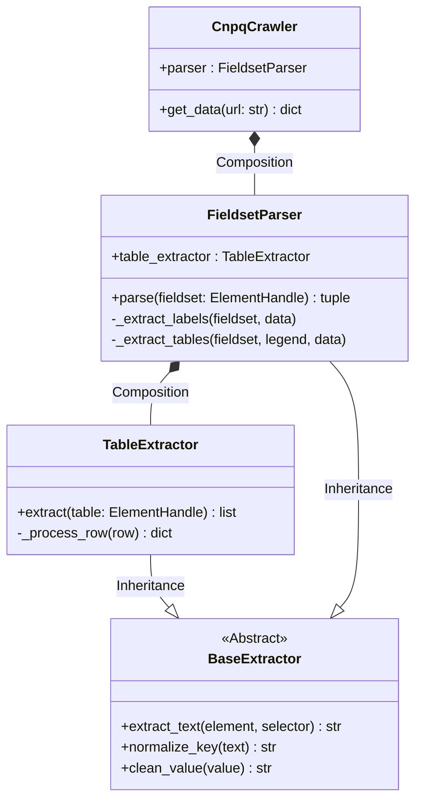

# SI2 - Análise e Design
**Projeto:** dgp.cnqp_lib
**Versão:** v0.1.0

---

# 1. Visão Geral
A biblioteca `dgp_cnpq_lib` atua como um Web Crawler especializado. Ela encapsula a complexidade do Playwright e da navegação no DOM do CNPq, expondo uma API simples para obtenção de dados estruturados.

---

# 2. Componentes Principais (src/dgp_cnpq_lib)

### 2.1 Core (`core.py`)
Componente central de orquestração.
- **Classe `CnpqCrawler`**:
    - Gerencia o ciclo de vida do browser (launch/close).
    - Exclusivamente responsável pela navegação (I/O).
    - Delega o parsing do HTML para a classe `FieldsetParser`.
    - **Método Principal**: `get_data(url: str) -> dict`.

### 2.2 Extractors (`extractors.py`)
Camada de lógica pura de transformação (HTML -> Dict).
- **Classe `BaseExtractor`**:
    - Abstração com métodos estáticos utilitários (`normalize_key`, `clean_value`, `extract_text`).
- **Classe `TableExtractor` (Herda de Base)**:
    - Processa tags `<table>`.
    - Normaliza cabeçalhos (`<th>`) para chaves snake_case.
    - Remove colunas inúteis (ex: "Ações").
    - Trata campos de data complexos ("De X a Y").
- **Classe `FieldsetParser` (Herda de Base)**:
    - Processa tags `<fieldset>`.
    - Extrai labels (chave: valor) e tabelas associadas.
    - Compõe uma instância de `TableExtractor` para processar tabelas encontradas.

### 2.3 CLI (`__main__.py`)
Ponto de entrada para execução via terminal.
- Instancia `CnpqCrawler`.
- Captura argumentos da linha de comando (`sys.argv`).
- Salva o resultado em arquivo JSON.

---

# 3. Diagrama de Classes Detalhado
Relação exata conforme implementação v0.1.0:

---

# 4. Fluxo de Execução
1. **User** executa `__main__.py`.
2. **CnpqCrawler** inicia Playwright e navega até a URL.
3. **CnpqCrawler** identifica todos os `<fieldset>`.
4. Para cada fieldset, invoca **FieldsetParser.parse()**.
5. **FieldsetParser** extrai textos simples (labels).
6. Se houver tabelas, **FieldsetParser** invoca **TableExtractor.extract()**.
7. **CnpqCrawler** compila o dicionário final e retorna.
8. **__main__.py** serializa em JSON e salva.