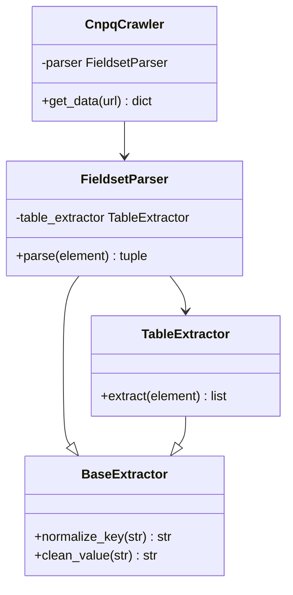

# SI2 - Análise e Design

## 1. Visão Geral da Arquitetura
O projeto `dgp_cnpq_lib` é uma biblioteca Python projetada para extrair dados do CNPq utilizando uma abordagem Orientada a Objetos.

## 2. Componentes Principais

### 2.1 Módulo `core`
- **Classe `CnpqCrawler`**: Responsável por orquestrar a navegação (via Playwright) e invocar os extratores.
    - `get_data(url: str) -> dict`: Método principal.

### 2.2 Módulo `extractors`
- **Classe `BaseExtractor`**: Classe base com utilitários de limpeza e normalização.
- **Classe `TableExtractor`**: Especializada em converter tabelas HTML em listas de dicionários.
- **Classe `FieldsetParser`**: Especializada em processar blocos `<fieldset>` do CNPq para extrair metadados e tabelas aninhadas.

## 3. Diagrama de Classes (Conceitual)

