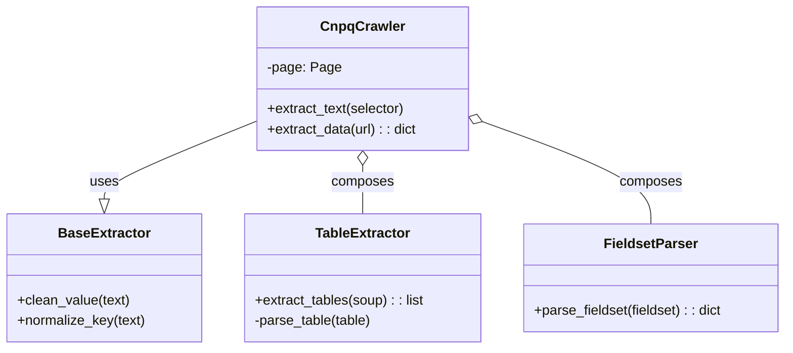

# SI.3 – Projeto de Software (Design)
**Projeto:** dgp.cnqp_lib
**Responsável:** Antigravity (Senior Designer)
**Versão:** v0.1.0

---

# 1. Objetivo do Documento
Definir a arquitetura da biblioteca `dgp.cnqp_lib`, focada em modularidade, orientação a objetos e facilidade de extensão para extração de dados do CNPq.

---

# 2. Visão Geral da Arquitetura
**Estilo:** Object-Oriented Library (Crawler)
**Pattern:** Page Object Model (adaptado para Scraper) / Strategy Pattern (para Extratores)

**Diretrizes:**
- **Encapsulamento**: Cada componente (Tabela, Fieldset, Cabeçalho) deve ter seu próprio parser.
- **Single Responsibility**: `CnpqCrawler` orquestra, `Extractors` parseiam.
- **Interface Pública Simples**: CLI e Classes acessíveis.

---

# 3. Diagrama de Classes (Mermaid)



---

# 4. Estrutura de Diretórios
```text
src/dgp_cnpq_lib/
├── __init__.py          # Exports públicos
├── __main__.py          # CLI Entrypoint (python -m dgp_cnpq_lib)
├── core.py              # Classe Principal (CnpqCrawler) e orquestração
└── extractors.py        # Logic de Parsing (TableExtractor, FieldsetParser)
```

---

# 5. Interfaces e Contratos

### 5.1 CnpqCrawler (`src/dgp_cnpq_lib/core.py`)
Principal ponto de entrada.
```python
class CnpqCrawler:
    def __init__(self):
        # Inicializa Playwright
    
    def extract_data(self, url: str) -> dict:
        # Navega e retorna JSON completo
```

### 5.2 Extractors (`src/dgp_cnpq_lib/extractors.py`)
Classes especializadas em tratar HTML.
```python
class TableExtractor(BaseExtractor):
    def extract(self, html_content) -> List[dict]:
        # Processa tabelas HTML em listas de objetos
```

---

# 6. Decisões de Design (ADRs)

| ID | Decisão | Justificativa |
|----|---------|---------------|
| **D1** | **Playwright** | Necessário para renderizar JavaScript do espelho do CNPq. |
| **D2** | **CLI Nativa** | Permite uso standalone sem necessidade de escrever scripts Python. |
| **D3** | **OO Pure** | Facilita testes unitários isolados para cada extrator. |
| **D4** | **Packaging Moderno** | `pyproject.toml` (hatchling) para compliance com PEP 517/518. |
